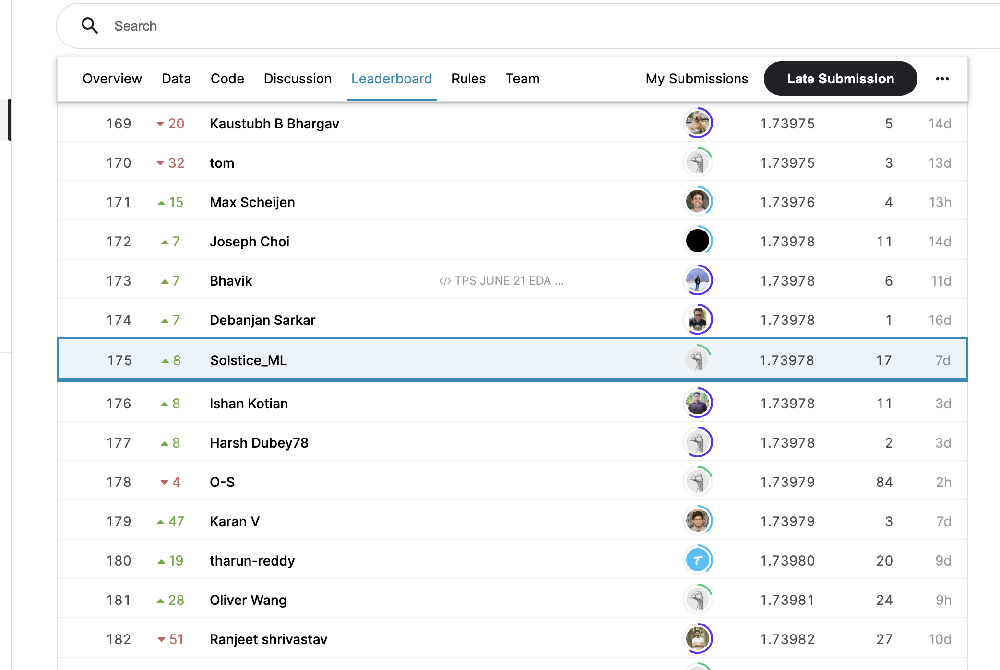

## 实验报告

191300085 周昱辙

### 最终成绩


    
github地址：https://github.com/Solsticev/ML-PS6

### GBDT

* #### 特征工程与模型选择

    特征工程决定了模型性能的上限，而选择模型则是逼近这个上限。因此特征工程很重要。但是对于这个问题，各个特征是匿名的，无法通过常识判断其是否是连续或者离散的属性，这无疑增大了特征工程的难度。考虑特征与结果的相似度，本人在实验过程中发现feature36和真正的结果关系的相关性最低。然而在删除feature36后继续进行实验发现无论是训练时间还是最终的结果都没有明显的变化，加上原数据集没有明显的噪声和缺失值于是经过再三考虑决定不对原数据集进行特殊处理。

    在模型选择的阶段，本人先后尝试了机器学习导论课上提到的几种常用的模型：对率回归，分类决策树和朴素贝叶斯。然后通过sklearn里模型中的'perdict_proba'来预测概率。在用默认参数的情况下，决策树的结果相较于其他两个模型预测结果较好。因此考虑选择GBDT来进行进一步的学习。

* #### 调参

    由于GBDT的参数较多，在调参的过程中很难一次找到最优解，因此选择固定其他参数，每次调一个参数来达到局部最优。在本次实验中，选择网格搜索和随机搜索来对GBDT的几个参数进行调参。

    由于网格搜索是暴力搜索，即使是对一个参数进行遍历花费的时间也很长。因此首先通过在一个合适的范围内对迭代次数进行确定。

    ```python
    param_test1 = {'n_estimators':range(20,81,10)}
    gsearch1 = GridSearchCV(estimator = GradientBoostingClassifier(
            learning_rate=0.1, min_samples_split=300, min_samples_leaf=10,
            max_depth=8,max_features='sqrt', subsample=0.8,random_state=10), 
            param_grid=param_test1, scoring='neg_log_loss',
            cv=5, n_jobs=-1)

    gsearch1.fit(feature_train, target_train)
    print(gsearch1.best_params_)
    print(gsearch1.best_score_)
    # output:{'n_estimators': 50} -1.755762303105438
    ```
    其中参数cv将数据集划分为训练集和测试集，n_jobs=-1代表用所有的CPU进行运算以增加训练速度。

    接下来确定剪枝参数max_depth

    ```python
    param_test2 = {'max_depth':range(3,11,1)}
    gsearch2 = GridSearchCV(estimator = GradientBoostingClassifier(
        n_estimators=50 ,learning_rate=0.1, min_samples_split=300,
        min_samples_leaf=10,max_features='sqrt', subsample=0.8,random_state=10), 
        param_grid=param_test2, scoring='neg_log_loss',
        cv=5, n_jobs=-1)

    gsearch2.fit(feature_train, target_train)
    print(gsearch2.best_params_)
    print(gsearch2.best_score_)
    # output: {'max_depth': 6} -1.7529371056648926
    ```

    接下来确定叶子节点包含的最少样本数min_samples_leaf以及每个内部节点包含的样本数min_samples_split，这些参数设置过小会导致过拟合，反之会欠拟合。由于搜索的参数范围较大，因此考虑使用随机搜索。

    ```python
    param_test3 = {'min_samples_split':range(10,2000,20)}
    gsearch3 = RandomizedSearchCV(estimator = GradientBoostingClassifier(
        max_depth=6, n_estimators=50 ,
        learning_rate=0.1,
        min_samples_leaf=10,max_features='sqrt', subsample=0.8,random_state=10), 
        aram_distributions=param_test3, scoring='neg_log_loss',
        cv=5, n_jobs=-1)

    gsearch3.fit(feature_train, target_train)
    print(gsearch3.best_params_)
    print(gsearch3.best_score_)
    # output: {'min_samples_split': 1690} -1.7521175591774736
    ```

    ```python
    param_test4 = {'min_samples_leaf':range(10,2000,20)}
    gsearch4 = RandomizedSearchCV(estimator = GradientBoostingClassifier(
        min_samples_split=1690, 
        max_depth=6, n_estimators=50 ,learning_rate=0.1,
        min_samples_leaf=10,max_features='sqrt', subsample=0.8,random_state=10), 
        param_distributions=param_test4, scoring='neg_log_loss',
        cv=5, n_jobs=-1, n_iter=15)

    gsearch4.fit(feature_train, target_train)
    print(gsearch4.best_params_)
    print(gsearch4.best_score_)
    # output: {'min_samples_leaf': 1950} -1.7500687198400509
    ```

    ```python
    param_test4 = {'min_samples_leaf':range(1500,8000,100)}
    gsearch4 = RandomizedSearchCV(estimator = GradientBoostingClassifier(
        min_samples_split=1690, 
        max_depth=6, n_estimators=50 ,learning_rate=0.1,
        min_samples_leaf=10,max_features='sqrt', subsample=0.8,random_state=10), 
        param_distributions=param_test4, scoring='neg_log_loss',
        cv=5, n_jobs=-1, n_iter=15)

    gsearch4.fit(feature_train, target_train)
    print(gsearch4.best_params_)
    print(gsearch4.best_score_)
    # output: {'min_samples_leaf': 2100} -1.7499949968071256
    '''
    ```

    最后确定限制分枝时考虑的特征个数max_feature。超过该参数限制个数的特征都会被舍弃，可以用来增加训练速率和防止模型过拟合。

    ```python
    param_test6 = {'max_features':range(0,30,1)}
    gsearch6 = RandomizedSearchCV(estimator = GradientBoostingClassifier(
        min_samples_leaf=2100, 
        min_samples_split=1690, max_depth=6, n_estimators=50 ,learning_rate=0.1,
        subsample=0.8,random_state=10), 
        param_distributions=param_test6, scoring='neg_log_loss',
        cv=5, n_jobs=-1, n_iter=15)

    gsearch6.fit(feature_train, target_train)
    print(gsearch6.best_params_)
    print(gsearch6.best_score_)
    # output: {'max_features': 8} -1.7499949968071256
    ```

* #### 训练和预测

    模型训练完成后尝试对测试集进行训练

    ```python
    # model = GradientBoostingClassifier(max_depth=6, learning_rate=0.1, n_estimators=60, min_samples_leaf=2100, max_features=8, subsample=0.8, random_state=10, min_samples_split =1690)
    # result: 1.75312
    ```

    该结果比本人第一次随机设置的参数提交结果损失值下降了0.05，可见调参效果显著。

    将迭代次数扩大40倍，步长减小40倍

    ```python
    # model = GradientBoostingClassifier(max_depth=6, learning_rate=0.0025, n_estimators=2400, min_samples_leaf=2100, max_features=8, subsample=0.8, random_state=10, min_samples_split =1690)
    # result: 1.75079
    ```

    再次增加迭代次数

    ```python
    # model = GradientBoostingClassifier(max_depth=6, learning_rate=0.0005, n_estimators=12000, min_samples_leaf=2100, max_features=8, subsample=0.8, random_state=10, min_samples_split =1690)
    # result: 1.75069
    ```

    可见此时再次增加迭代次数已经对损失的下降效果提升不明显，推测在设置的参数下，模型的性能已经趋于极限。

    对于boost的其他模型，本人先后尝试了XGboost，Lightbgm和catboost调参之后最好的result徘徊在1.749左右，由于调参过程类似，在实验报告不进行详述。

### NN

查看kaggle开源社区参赛者分享的notebook，发现神经网络的泛化性能很好。于是选择建立NN模型。在本人的实现中调用了keras里的深度学习模型，由于缺乏模型设计的经验，得出的结果和GBDT模型最终结果差不多。得益于kaggle平台开源的代码，参考建立了卷积神经网络模型。

* #### layers的设计    
    
    神经网络的嵌入层是很有必要的，因为它们可以减少类别变量的维数，并有意义地在转换空间中表示类别，并且其克服了one-hot编码的映射无监督的缺陷。构造嵌入层如下：
    ```python
    embed = layers.Embedding (input_dim = 354, 
                              output_dim = 7,
                              embeddings_regularizer='l2')(conv_inputs)
    ```
    
    用卷积层来进行特征提取
    ```python
    embed = layers.Conv1D(12,1,activation = 'relu')(embed)        
    embed = layers.Flatten()(embed)
    hidden = layers.Dropout(0.3)(embed)
    ```
    
    接下来是残差块的设计，引入残差块可以用来解决深度神经网络的退化问题，即给网络叠加层数后性能快速下降的情况。虽然给网络叠加层数总能找到更优于未叠加网络的解，但是优化深层网络是一件比较困难的事。残差块可以通过调整模型结构让模型更易于优化。针对该问题，设计残差块如下
    ```python
    hidden = tfa.layers.WeightNormalization(
                layers.Dense(
                units=32,
                activation ='selu',
                kernel_initializer = "lecun_normal"))(hidden)
    
    output = layers.Dropout(0.3)(layers.Concatenate()([embed, hidden]))
    output = tfa.layers.WeightNormalization(
    layers.Dense(
                units = 32,
                activation='relu',
                kernel_initializer = "lecun_normal"))(output) 
    output = layers.Dropout(0.4)(layers.Concatenate()([embed, hidden, output]))
    output = tfa.layers.WeightNormalization(
    layers.Dense(
                units = 32, 
                activation = 'elu',
                kernel_initializer = "lecun_normal"))(output)
    ```
    最后是输出层
    ```python
    conv_outputs = layers.Dense(
                units = 9, 
                activation ='softmax',
                kernel_initializer ="lecun_normal")(output)
    ```

* #### 采样与训练

    K折交叉验证法先将数据集划分为K个大小相似的互斥子集，每个子集都尽可能保持数据分布的一致性，即也采用分层采样的方法。然后，每次用k-1个子集的并集作为训练集，余下的那个子集作为测试集，这样就可以获得K组训练集和测试集，从而可以进K次训练和测试。最终返回的是这K个测试结果的均值。显然，K折交叉验证法的评估结果的稳定性和保真性在很大程度上取决于K的取值。

    在实验中用StratifiedKFold分层采样，用于交叉验证。StratifiedKFold方法可以根据标签中不同类别占比来进行拆分数据。

    ```python
    for fold, (tr_idx, ts_idx) in enumerate(skf.split(train,train.iloc[:,-1])):
   
    X_train = train.iloc[:,1:-1].iloc[tr_idx]
    y_train = targets.iloc[tr_idx]
    X_test = train.iloc[:,1:-1].iloc[ts_idx]
    y_test = targets.iloc[ts_idx]

    K.clear_session()

    model_conv = conv_model()

    model_conv.compile(loss='categorical_crossentropy', ptimizer = keras.optimizers.Adam(learning_rate=2e-5), metrics=custom_metric)
    model_conv.fit(X_train, y_train,
              batch_size = 256, epochs = EPOCH,
              validation_data=(X_test, y_test),
              callbacks=[es, plateau],
              verbose = 0)
   
    pred_a = model_conv.predict(X_test) 
    oof_NN_a[ts_idx] += pred_a 
    score_NN_a = log_loss(y_test, pred_a)

    pred_NN_a += model_conv.predict(test.iloc[:,1:]) / N_FOLDS 
    ```
    最终取预测的的平均作为最终的模型的预测。提交到kaggle官网，发现损失有显著降低，保持层级结构不变，调整参数最终的result可以到1.744左右。

### 实验收获

通过本次实验，本人体会到了运用机器学习解决解决实际问题的方法。对于模型的选择，调参的技巧积累了经验。同时通过本次实验了解到了深度学习中神经网络的强大。尽管神经网络在本次实验中取得了良好的成绩，我相信并不是所有问题神经网络都适用，而且它也有自己的缺点。因为在本次实验中本人深刻感受到了神经网络和其他模型训练速度的差异。